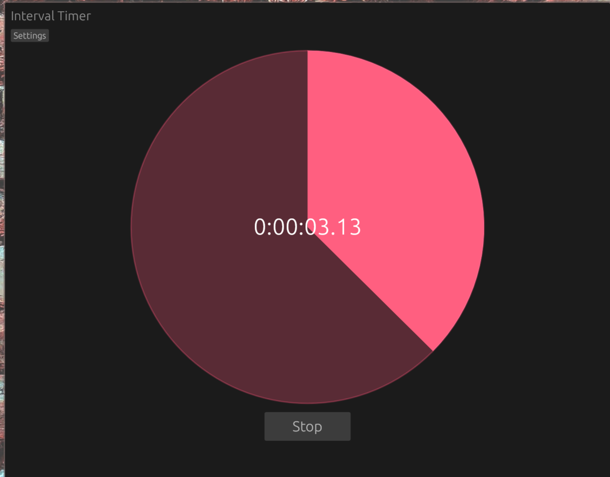

# Interval Timer

**A customizable interval countdown timer built with Rust, eframe (egui), and rodio.**

This desktop app allows you to create and run sequences of countdown timers, each with custom durations and colors, with a smooth animated UI and a satisfying sound effect on completion. Useful for many applications such as working out, meditation, gaming, and many more.

## ✨ Features



- 🌀 Visual countdown display
- 🎨 Customizable timer durations and colors
- 🔊 Sound chime playback on interval completion
- ⚙️ Configurable settings via GUI and config file
- 🖥 Cross platform native desktop app
- 💾 Persistent configuration

## 🛠 Usage

### Running the App

```sh
cargo run --release
```

### Configuration File

When the app starts, it loads or creates a config file at:

- **Linux**: `$XDG_CONFIG_HOME/interval-timer/config.txt` or `$HOME/.config/interval-timer/config.txt`
- **macOS**: `$HOME/Library/Application Support/interval-timer/config.txt`
- **Windows**: `%APPDATA%\interval-timer\config.txt`

Example config:

```
timers=5000#ff0000,3000#00ff00,7000#0000ff
tick_interval=50
play_once=false
vol=0.5
```

- `timers`: A comma-separated list of `{duration_ms}#{rrggbb}` entries
- `tick_interval`: UI refresh rate in milliseconds
- `play_once`: If true, stops after the last timer
- `vol`: Sound volume (0.0 to 1.0)

### In-App Editing

Click **Settings** in the app to:

- Add/edit timer durations and colors
- Adjust volume
- Save changes back to the config file

## 🔧 Development

This project uses:

- [`eframe`](https://docs.rs/eframe/latest) for the GUI
- [`rodio`](https://docs.rs/rodio/latest) for audio playback

### Build Requirements

- Rust 1.77+ (2024 edition)

## 📁 Project Structure

```
src/
├── app.rs                # Main App logic and update loop
├── main.rs               # Entry point
├── internal/             # Logic & utilities
└── ui/                   # UI components
```
